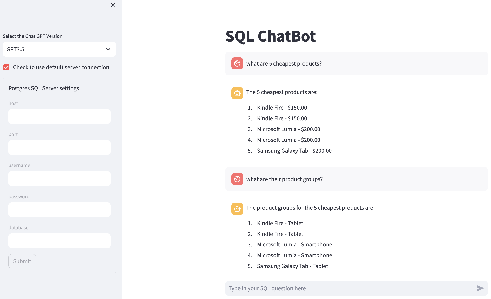
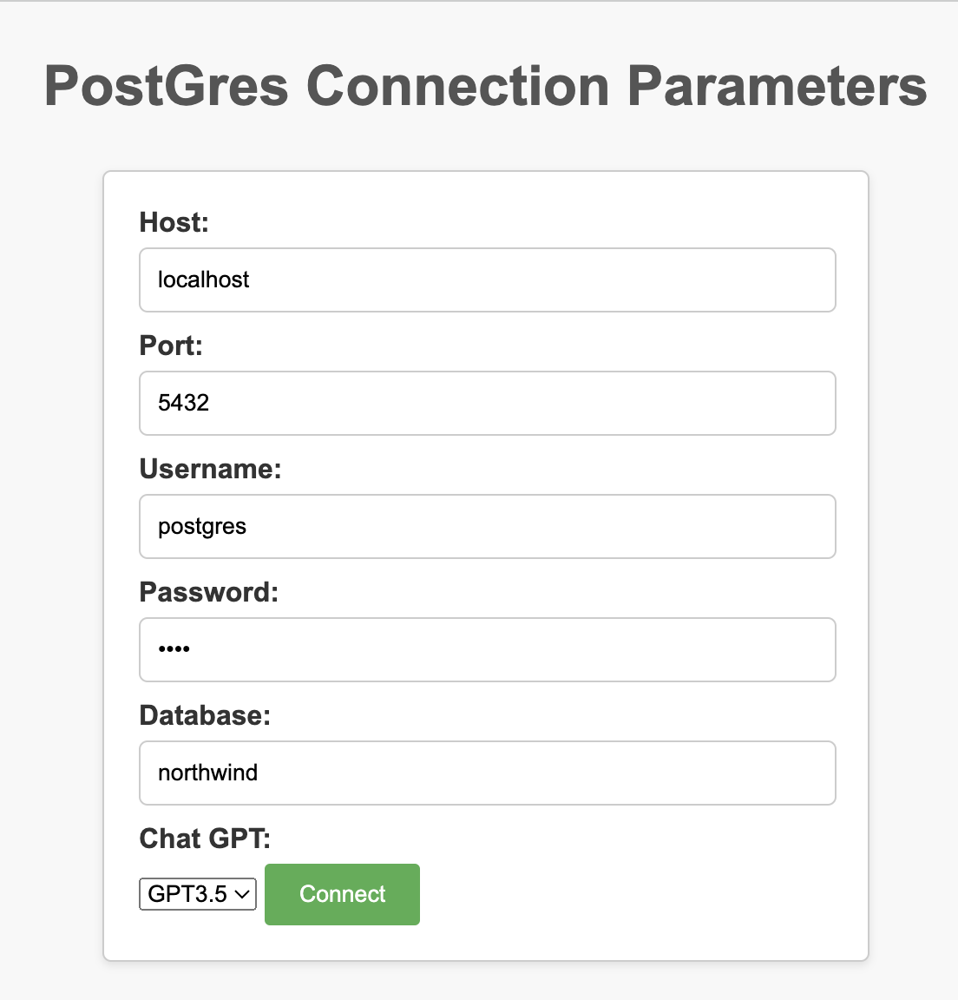

# chatbot_SQL

The objective of this project was to create an LLM powered chatbot to query an SQL database. Two versions of the app were implemented using the **Streamlit** and **Chainlit** frameworks.

## Project Requirements

- Foundation LLM Model should be OpenAI GPT 3.5, with the ability to switch to GPT 4 or later.
- Memory - the chatbot should be able to retain enough memory to carry out a conversation and not require context for each query.
- Retrieval/Memory should be `Langchain`.
- UI/UX deployment - `Streamlit` or `Chainlit`

# Overview

**Langchain `db_chain`**: The Langchain class `SQLDatabaseChain` is the building block of the chatbotSQL app. It provides a tool for integrating the LLM model with a PostgresSQL database. The `db_chain` object translates a natural language question into an SQL query that runs on the database. The results are also translated into a natural 'conversational' format by implementing memory with `ConversationalBufferMemory` and a unique `last_answer` history.

**LLMs**: The apps run on ChatGPT 3.5 by default with the option to switch to GPT 4.0.

**Postgres SQL**: Both applications provide fields for postgres login details, enabling the user to switch the database.

## Live Demos

**Note** that both demos are running on a free Open API account and therefore have limits of 3 calls per minute and a limit of 200 calls per day. Alternatively, you can clone the github repo, install the requiments (please note the versions), provide premium API Keys, and run from their source directories.

### StreamLit

The streamlit app is hosted online here: [**SQL Chatbot with Streamlit**](https://chatbotsql.streamlit.app/).

Or locally, from Terminal in the `streamlit/src/` directory:

`streamlit run app.py`

### ChainLit

The demo version of this is hosted on an Ubuntu AWS EC2 instance.

[**Postgres Server Connection Page**](http://ec2-3-21-56-191.us-east-2.compute.amazonaws.com:5000/) - This is the page to either enter your postgres server connection details or accept the provided default values. It should immediately redirect you to the Chatbot. However, if that doesn't work, then please click the link below.

[**SQL Chabot with Chainlit**](http://ec2-3-21-56-191.us-east-2.compute.amazonaws.com:8000)

Or locally, from Terminal in the `chainlit/src/` directory:

`python app.py`

### Observation and Future Work:

- In my experience, Streamlit is better for chatbot implementation. The framework has more options, is more user-friendly, and provides a rich documentation library for support. Future improvements to this will be done on this platform.

- Future work will include integrating various methods of connecting to SQL databases and other database tools; and implementing vector embeddings.
